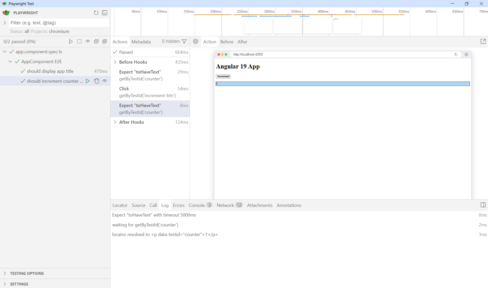

# PlaywrightBasic



## ✅ First Real Angular E2E Test (Playwright)
🎯 Scenario (Very Interview-Friendly)
```
User opens the app → sees home page → clicks a button → UI updates
```

This covers:
    -   Page load
    -   Accessibility selectors
    -   User interaction
    -   Assertion on UI change

**1️⃣ Folder Structure**
```
tests/
 └── e2e/
     └── home.spec.ts
```

**2️⃣ Home Page E2E Test**
tests/e2e/home.spec.ts
```
import { test, expect } from '@playwright/test';

test.describe('Home Page', () => {

  test('should load and show the app title', async ({ page }) => {
    await page.goto('/');

    // App root should be visible
    await expect(page.locator('app-root')).toBeVisible();

    // Title check (change text to match your app)
    await expect(
      page.getByRole('heading', { name: /angular/i })
    ).toBeVisible();
  });

  test('should increment counter when button is clicked', async ({ page }) => {
    await page.goto('/');

    const incrementBtn = page.getByRole('button', { name: /increment/i });
    const counter = page.locator('[data-testid="counter"]');

    await expect(counter).toHaveText('0');

    await incrementBtn.click();

    await expect(counter).toHaveText('1');
  });

});
```

**3️⃣ Small Angular Change (Best Practice)**

Add test IDs so tests don’t break on UI changes.

Angular Template
```
<h1>Angular 19 App</h1>

<p data-testid="counter">{{ count() }}</p>

<button (click)="increment()">Increment</button>
```

>💡 Interview tip: “I use data-testid to keep E2E tests stable and avoid coupling to CSS or layout.”


### 🧪 Why this works perfectly with Playwright

Your E2E test:

const counter = page.locator('[data-testid="counter"]');
const incrementBtn = page.getByRole('button', { name: /increment/i });


✔ data-testid → stable selector
✔ getByRole('button') → accessibility-first
✔ Signal updates → auto-detected by Playwright
✔ No waitForAngular() needed

## ▶️ Run
```
ng serve
npx playwright test --ui
```

✔ Button click  
✔ Angular change detection  
✔ Counter updates to 1  
✔ Test passes 🎉  